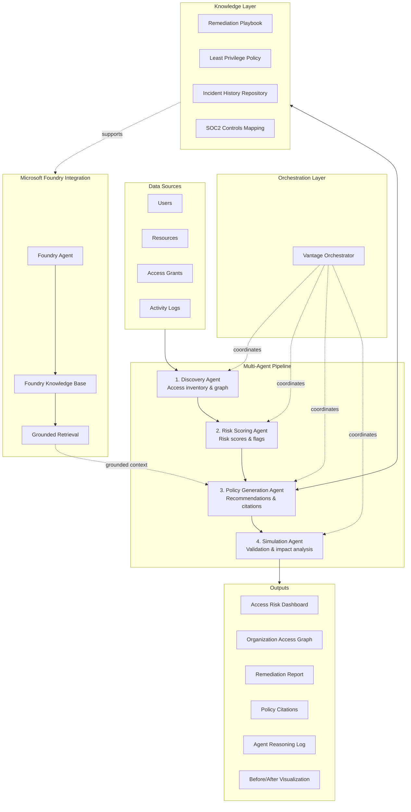
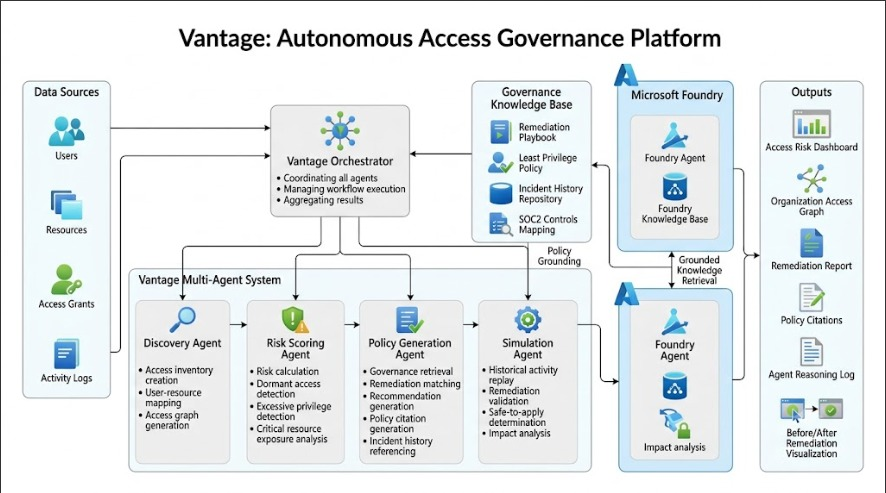
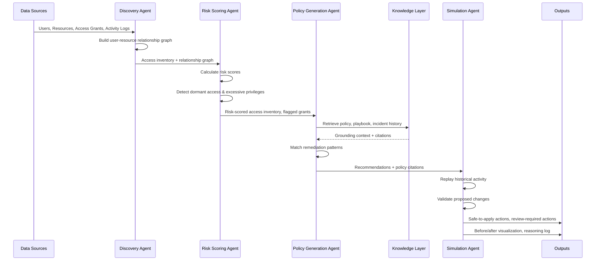
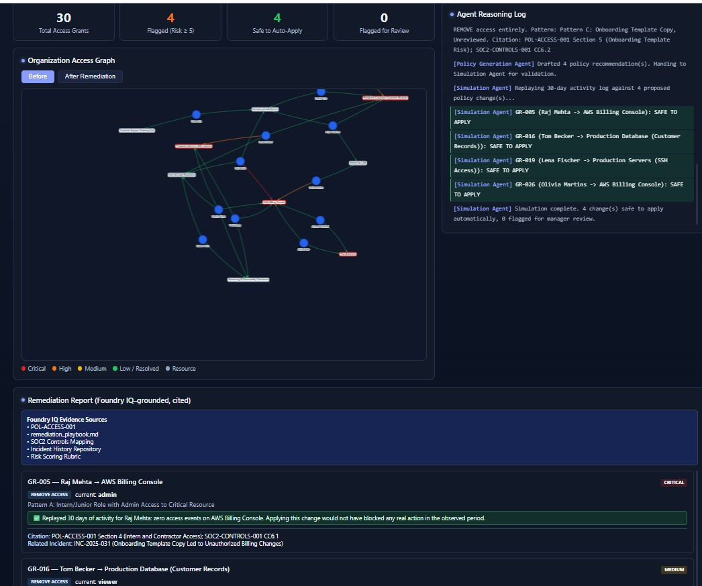
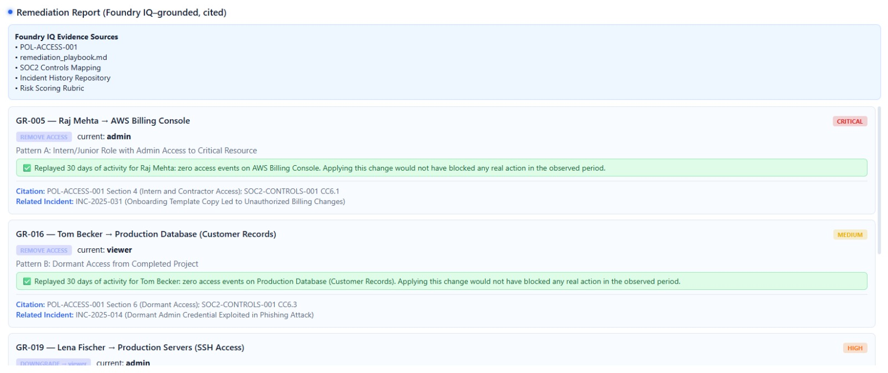
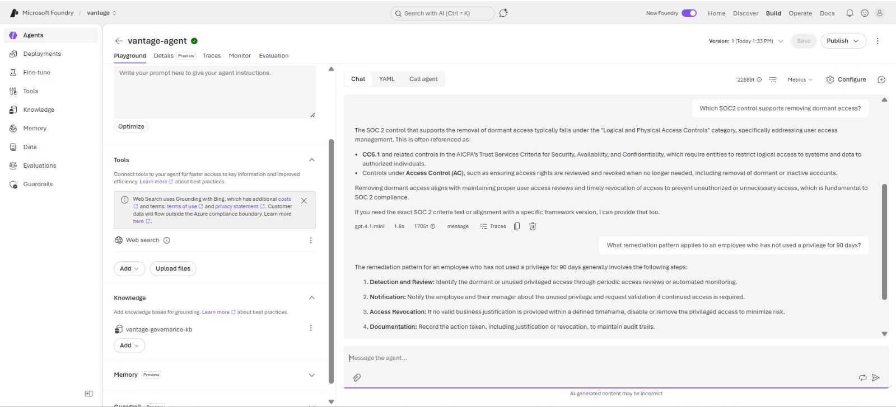
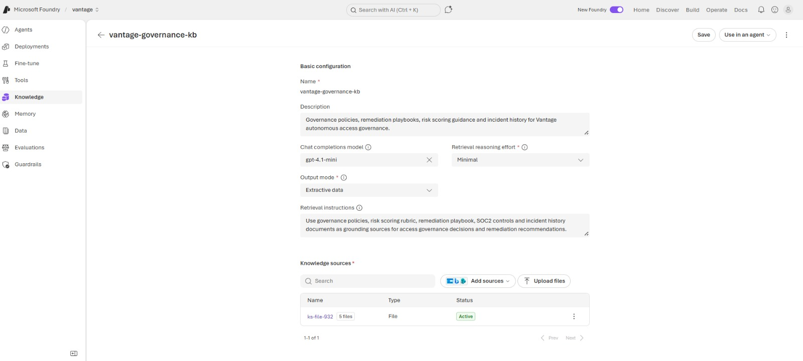
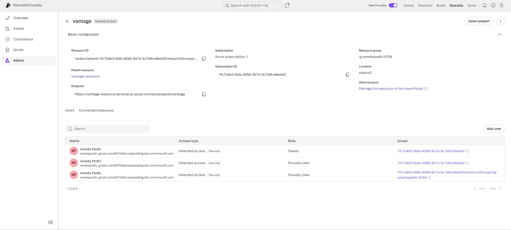

# Vantage💻

**Autonomous Access Governance Platform**

Vantage is a multi-agent system for identifying risky permissions, generating policy-grounded governance recommendations, and validating remediation actions prior to implementation.


---

## Executive Summary

Vantage analyzes organizational access relationships across users, resources, access grants, and activity logs to produce an actionable governance picture of an environment. Rather than relying on static rule sets or one-off audits, Vantage uses a coordinated pipeline of specialized agents that build an access inventory, score risk, generate remediation recommendations grounded in policy and incident history, and simulate the impact of proposed changes before they are applied.

The result is a system that can continuously surface excessive permissions, dormant access, and compliance exposure, while producing recommendations that are traceable to specific policies and that have been validated against historical activity to reduce the risk of operational disruption.

---

## Problem Statement

Access governance in most organizations degrades over time due to a combination of organizational growth, role changes, and the absence of systematic review processes. Common failure patterns include:

- **Excessive permissions** — users retain access beyond what their current role requires.
- **Dormant accounts** — accounts and grants that are no longer in active use but remain provisioned.
- **Privilege creep** — incremental accumulation of access rights without corresponding removal.
- **Unreviewed access grants** — permissions granted for temporary or project-based needs that are never revisited.
- **Compliance risk** — access configurations that drift out of alignment with frameworks such as SOC 2.

Manual access reviews are typically conducted on a periodic basis (quarterly or annually), are labor-intensive, depend heavily on the judgment of individual reviewers, and do not scale with the size or complexity of modern organizational environments. By the time a manual review identifies an issue, the exposure window may have existed for months.

---

## Solution Overview

Vantage addresses this problem by automating the access governance lifecycle through a multi-agent pipeline:

1. **Discovery** — build a complete, current picture of who has access to what.
2. **Risk scoring** — quantify and prioritize risk across the access landscape.
3. **Policy-grounded recommendations** — generate remediation guidance backed by governance policy and incident precedent.
4. **Simulation and validation** — verify that proposed changes are safe to apply before they reach production.

Each stage is handled by a dedicated agent with a narrow, well-defined responsibility. The agents are coordinated by a central orchestrator and share a common data model, allowing the pipeline to be run end-to-end or inspected at each intermediate stage.

---

## Key Features

- **Automated access discovery** across users, resources, and access grants, with construction of a user-resource relationship graph.
- **Quantitative risk scoring** that identifies excessive privileges, dormant access, and exposure on critical resources.
- **Policy-grounded recommendations** that cite the specific governance policy or playbook entry supporting each suggested action.
- **Incident-aware reasoning**, referencing historical incidents relevant to a given access pattern.
- **Pre-implementation simulation** that replays historical activity against proposed changes to identify actions that are safe to apply automatically versus those requiring human review.
- **Auditable agent reasoning log**, providing a record of the inputs, intermediate outputs, and decisions made at each pipeline stage.
- **Before/after remediation visualization** to communicate the impact of proposed changes.
- **Interactive organizational access graph** rendered in the frontend for visual exploration of access relationships.

---

## System Architecture

Vantage is composed of five logical layers:

| Layer | Responsibility |
|---|---|
| **Data sources** | Provide raw organizational data: users, resources, access grants, and activity logs. |
| **Multi-agent pipeline** | Four sequential agents that transform raw access data into validated governance recommendations. |
| **Orchestration layer** | Coordinates execution order, data handoff, and state across the four pipeline agents. |
| **Knowledge layer** | Provides policy, playbook, incident history, and compliance mapping context used to ground recommendations. |
| **Outputs** | Dashboards, graphs, reports, citations, reasoning logs, and visualizations consumed by end users. |

The Policy Generation Agent additionally connects to a knowledge-grounding workflow that has been explored using Microsoft Foundry, described in detail in the [Microsoft Foundry Integration](#microsoft-foundry-integration) section.

---

## Architecture Diagram






---

## Multi-Agent Workflow

The pipeline executes as a sequential chain, with each agent consuming the output of the previous stage and producing a defined output for the next.



### Stage descriptions

**1. Discovery Agent**
Loads organizational access data from the configured sources, constructs a user-resource relationship graph, identifies existing permissions, and produces a structured access inventory used as the foundation for all subsequent stages.

**2. Risk Scoring Agent**
Consumes the access inventory and computes governance risk scores. This stage identifies excessive privileges relative to peer groups or role baselines, detects dormant access based on activity log analysis, identifies exposure on resources classified as critical, and flags high-risk grants for downstream review.

**3. Policy Generation Agent**
Takes the risk-scored inventory and retrieves relevant governance knowledge from the knowledge layer. It matches detected risk patterns against known remediation patterns, generates specific recommendations, attaches policy citations to each recommendation, and references relevant entries from the incident history repository where applicable.

**4. Simulation Agent**
Replays historical activity logs against the proposed remediation set to determine the operational impact of each change. Based on this replay, the agent classifies each proposed action as safe to apply automatically or as requiring human review, with the objective of preventing disruption to legitimate access patterns.

---

## Knowledge Grounding

The Policy Generation Agent's recommendations are grounded against a defined knowledge base rather than generated from general-purpose reasoning alone. The knowledge base consists of:

- **Remediation Playbook** — a catalog of standard remediation actions mapped to common risk patterns (for example, revoking dormant access, downscoping over-broad role assignments).
- **Least Privilege Policy** — the organization's documented policy defining acceptable access baselines for roles and resource types.
- **Incident History Repository** — records of past security incidents, used to identify whether a current risk pattern resembles a previously realized incident.
- **SOC2 Controls Mapping** — a mapping between access governance activities and the relevant SOC 2 trust services criteria, used to frame recommendations in compliance terms where applicable.

Every recommendation produced by the Policy Generation Agent includes a citation back to the specific knowledge base entry that justifies it. This allows reviewers to trace each recommendation to its source rather than treating it as an opaque output.

---

## Microsoft Foundry Integration

As part of exploring knowledge-grounding architectures for the Policy Generation Agent, this project includes an exploration of Microsoft Foundry as a candidate platform for agent configuration and grounded retrieval.

This integration is documentation and exploration in nature. It demonstrates:

- **Foundry Agent configuration** — setting up an agent definition within Microsoft Foundry intended to support the knowledge-grounding role of the Policy Generation Agent.
- **Foundry Knowledge integration** — connecting a knowledge source within Foundry that mirrors the governance knowledge base (policy documents, playbooks, incident records).
- **Grounding workflows** — the retrieval flow by which a Foundry-configured agent surfaces relevant knowledge base content in response to a query, intended to inform how the Policy Generation Agent's citation mechanism could be backed by Foundry-based retrieval in a production deployment.

Screenshots documenting this exploration are provided in the [Screenshots](#screenshots) section. This integration represents an architectural exploration of how Foundry could serve as the grounding backend for the knowledge layer; it does not constitute a production dependency of the deployed application, and no capabilities beyond what is shown in the accompanying screenshots are claimed.

---

## Technical Stack

### Backend

- **Python** — core application and agent logic
- **FastAPI** — REST API framework serving the multi-agent pipeline

### Frontend

- **HTML / CSS / JavaScript** — application interface
- **Vis.js** — interactive rendering of the organizational access graph

### Deployment

- **Render** — backend API hosting
- **Vercel** — frontend hosting

---

## Screenshots

### System Architecture


### Access Risk Dashboard



Overview dashboard summarizing risk scores, flagged grants, and key governance metrics for the analyzed organization.

### Remediation Report



Generated remediation report containing recommendations, associated policy citations, and references to relevant incident history.

### Agent Reasoning Log



Step-by-step reasoning log produced by the multi-agent pipeline, providing visibility into the inputs and outputs of each agent stage.

### Knowledge Base



View of the governance knowledge base components used to ground Policy Generation Agent recommendations.

### Project Overview



General overview of the Vantage application interface.

---

## Deployment

| Component | URL |
|---|---|
| Frontend | [https://vantage-blond.vercel.app](https://vantage-blond.vercel.app) |
| Backend API | [https://vantage-zzme.onrender.com](https://vantage-zzme.onrender.com) |

---

## API Endpoints

The backend exposes the following primary endpoints. All endpoints are served from the base URL `https://vantage-zzme.onrender.com`.

| Method | Endpoint | Description |
|---|---|---|
| `GET` | `/health` | Returns service health status. |
| `POST` | `/api/discovery` | Runs the Discovery Agent against the configured organizational data and returns the access inventory and relationship graph. |
| `POST` | `/api/risk-scoring` | Runs the Risk Scoring Agent against a given access inventory and returns risk scores and flagged grants. |
| `POST` | `/api/policy-generation` | Runs the Policy Generation Agent against flagged grants and returns recommendations with policy citations. |
| `POST` | `/api/simulation` | Runs the Simulation Agent against a set of proposed recommendations and returns safe-to-apply and review-required actions. |
| `POST` | `/api/pipeline/run` | Executes the full multi-agent pipeline end-to-end and returns the consolidated output set (dashboard data, access graph, remediation report, citations, reasoning log, before/after data). |
| `GET` | `/api/access-graph` | Returns the current organizational access graph data for visualization. |
| `GET` | `/api/reports/{report_id}` | Retrieves a previously generated remediation report by identifier. |
| `GET` | `/api/knowledge-base` | Returns the contents and metadata of the governance knowledge base used for grounding. |

Exact request and response schemas are defined in the FastAPI-generated OpenAPI documentation, available at `/docs` on the backend URL.

---

## Example Analysis Workflow

The following sequence describes a typical end-to-end analysis run:

1. **Submit organizational data.** Users, resources, access grants, and activity logs are submitted to the Discovery Agent via `/api/discovery`.
2. **Review access inventory.** The Discovery Agent returns a structured access inventory and a user-resource relationship graph, viewable as the Organization Access Graph.
3. **Run risk scoring.** The access inventory is passed to `/api/risk-scoring`, which returns governance risk scores, identifies dormant access and excessive privileges, and flags high-risk grants.
4. **Generate recommendations.** Flagged grants are passed to `/api/policy-generation`, which returns remediation recommendations, each with a policy citation and, where applicable, a reference to related incident history.
5. **Simulate proposed changes.** Recommendations are passed to `/api/simulation`, which replays historical activity against the proposed changes and classifies each as safe to apply or as requiring review.
6. **Review outputs.** The consolidated outputs — Access Risk Dashboard, Remediation Report, Policy Citations, Agent Reasoning Log, and Before/After Remediation Visualization — are reviewed by a governance team member, who applies the safe-to-apply changes and manually evaluates the remainder.

The full sequence can also be executed in a single call via `/api/pipeline/run`.

---

## Repository Structure

```
vantage/
├── backend/
│   ├── app/
│   │   ├── main.py                 # FastAPI application entry point
│   │   ├── api/
│   │   │   ├── discovery.py        # Discovery Agent endpoints
│   │   │   ├── risk_scoring.py     # Risk Scoring Agent endpoints
│   │   │   ├── policy_generation.py# Policy Generation Agent endpoints
│   │   │   ├── simulation.py       # Simulation Agent endpoints
│   │   │   └── pipeline.py         # Orchestrated pipeline endpoint
│   │   ├── agents/
│   │   │   ├── discovery_agent.py
│   │   │   ├── risk_scoring_agent.py
│   │   │   ├── policy_generation_agent.py
│   │   │   └── simulation_agent.py
│   │   ├── orchestrator/
│   │   │   └── orchestrator.py     # Vantage Orchestrator
│   │   ├── knowledge_base/
│   │   │   ├── remediation_playbook.json
│   │   │   ├── least_privilege_policy.json
│   │   │   ├── incident_history.json
│   │   │   └── soc2_controls_mapping.json
│   │   ├── models/
│   │   │   └── schemas.py          # Pydantic data models
│   │   └── core/
│   │       └── config.py
│   ├── requirements.txt
│   └── Dockerfile
│
├── frontend/
│   ├── index.html
│   ├── dashboard.html
│   ├── css/
│   │   └── styles.css
│   ├── js/
│   │   ├── app.js
│   │   ├── access-graph.js         # Vis.js graph rendering
│   │   └── api-client.js
│   └── assets/
│
├── screenshots/
│   ├── architecture.png
│   ├── dashboard.jpeg
│   ├── report.jpeg
│   ├── agent.jpeg
│   ├── kb.jpeg
│   └── project.jpeg
│
├── docs/
│   └── foundry/                    # Microsoft Foundry exploration notes/screenshots
│
├── .env.example
└── README.md
```

---

## Local Setup Instructions

### Prerequisites

- Python 3.10 or later
- pip
- Node.js 18 or later (if serving the frontend with a local dev server)
- Git

### Clone the repository

```bash
git clone https://github.com/<your-org>/vantage.git
cd vantage
```

### Backend setup

```bash
cd backend
python -m venv venv
source venv/bin/activate   # On Windows: venv\Scripts\activate

pip install -r requirements.txt
```

Create a `.env` file based on `.env.example` and configure any required environment variables (for example, knowledge base paths or external service credentials).

### Frontend setup

```bash
cd frontend
# Static files — can be served directly or via a simple HTTP server
```

---

## Running the Application

### Run the backend (FastAPI)

```bash
cd backend
uvicorn app.main:app --reload --port 8000
```

The API will be available at `http://localhost:8000`, with interactive API documentation at `http://localhost:8000/docs`.

### Run the frontend

```bash
cd frontend
python -m http.server 5500
```

The frontend will be available at `http://localhost:5500`. Configure the frontend's API client (`js/api-client.js`) to point to the local backend URL during development.

### Run the full pipeline locally

Once both services are running, submit a sample organizational dataset to the pipeline endpoint:

```bash
curl -X POST http://localhost:8000/api/pipeline/run \
  -H "Content-Type: application/json" \
  -d @sample_data/sample_org.json
```

---

## Live Demo

- **Frontend:** [https://vantage-blond.vercel.app](https://vantage-blond.vercel.app)
- **Backend API:** [https://vantage-zzme.onrender.com](https://vantage-zzme.onrender.com)
- **API Documentation:** [https://vantage-zzme.onrender.com/docs](https://vantage-zzme.onrender.com/docs)

---

## Demo Video Placeholder

A walkthrough video demonstrating the full Vantage workflow — from data ingestion through risk scoring, policy-grounded recommendations, simulation, and final outputs — will be linked here.

```
https://drive.google.com/file/d/1PFw3eIt240clPYDpkqC5qZ1PHVIre1Pt/view?usp=drivesdk
```

---

## Future Enhancements

- Integration with live identity provider sources (for example, Azure AD, Okta) for direct access data ingestion rather than static datasets.
- Production-grade knowledge-grounding backend using Microsoft Foundry, extending the current exploration into a deployed retrieval service.
- Role-based access baselines derived from peer-group analysis to improve excessive privilege detection accuracy.
- Scheduled, recurring pipeline runs with delta-based reporting between runs.
- Expanded simulation coverage, including multi-step remediation sequences and rollback planning.
- Audit-trail export in formats suitable for compliance reporting (for example, SOC 2 evidence packages).
- Role-based access control for the Vantage application itself, separating governance reviewers from administrative users.

---

## Security Considerations

- Vantage operates on organizational access metadata (users, resources, access grants, activity logs) and is designed to support, not replace, human review of governance recommendations.
- All proposed remediation actions pass through the Simulation Agent prior to being marked safe to apply; actions with uncertain impact are explicitly routed to human review rather than applied automatically.
- Recommendations are accompanied by policy citations and, where relevant, incident history references, to support auditability of governance decisions.
- The application does not perform remediation actions directly against production identity or access management systems in its current form; outputs are recommendations and reports intended for review and manual or assisted application.
- Deployment credentials, API keys, and any external service configuration should be managed via environment variables and excluded from version control (see `.env.example`).
- The Microsoft Foundry exploration documented in this repository involves configuration and knowledge sources intended for evaluation purposes and should be reviewed for organizational suitability before any production use.

---

## Acknowledgements

This project was developed as an exploration of multi-agent architectures applied to access governance, drawing on established access governance and compliance frameworks (including least privilege principles and SOC 2 trust services criteria) as the basis for the knowledge layer.

## Author

Anwita Padhi


